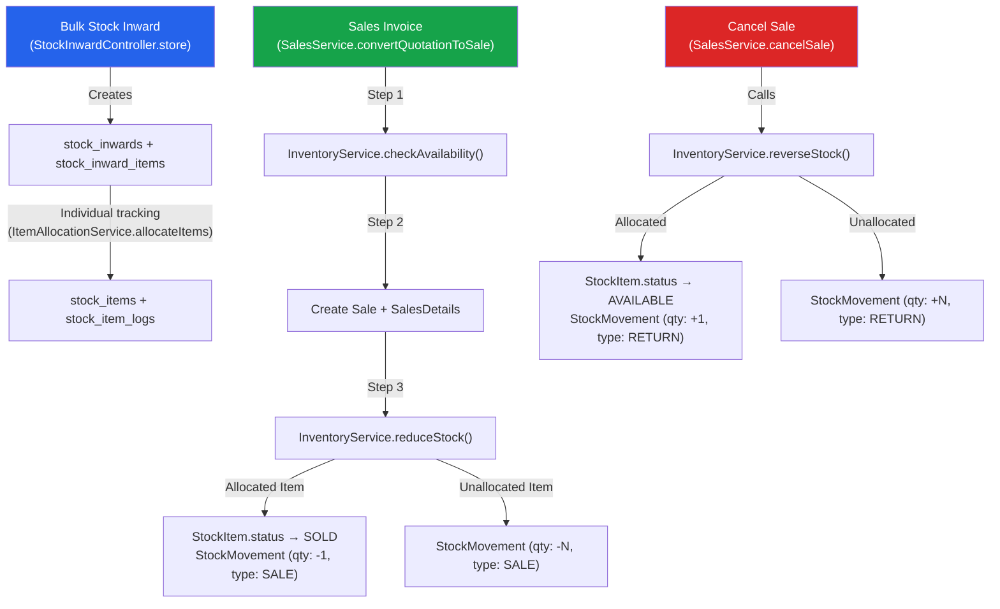

# NovaAdmin ERP — Stock Movement Architecture Review

**Review Type:** Production Readiness Audit — Pre-Report Development  
**Reviewer Role:** Senior ERP Solution Architect  
**Date:** 2026-08-02  
**Scope:** Complete Stock Movement Architecture for Stock Register Report Feasibility

---

## PHASE 1 — Stock Movement Implementation Review

### 1.1 Inventory Data Architecture (4 Tables)

| Table | Purpose | Migration |
|---|---|---|
| `stock_inwards` | Bulk purchase header (supplier, invoice, branch) | [create_stock_inwards_table.php](file:///d:/project/laravel/NovaAdmin/database/migrations/2026_07_20_130000_create_stock_inwards_table.php) |
| `stock_inward_items` | Purchase line items (product, qty, price) | [create_stock_inward_items_table.php](file:///d:/project/laravel/NovaAdmin/database/migrations/2026_07_20_130001_create_stock_inward_items_table.php) |
| `stock_items` | Individual serialized inventory units | [create_stock_items_table.php](file:///d:/project/laravel/NovaAdmin/database/migrations/2026_07_21_160001_create_stock_items_table.php) |
| `stock_item_logs` | Immutable audit trail for individual items | [create_stock_item_logs_table.php](file:///d:/project/laravel/NovaAdmin/database/migrations/2026_07_21_160002_create_stock_item_logs_table.php) |
| `stock_movements` | Unified movement ledger (quantity in/out) | [create_stock_movements_table.php](file:///d:/project/laravel/NovaAdmin/database/migrations/2026_07_25_080000_create_stock_movements_table.php) |

### 1.2 Model Layer

| Model | File | Key Relationships |
|---|---|---|
| [StockMovement](file:///d:/project/laravel/NovaAdmin/app/Models/StockMovement.php) | 88 lines | company, branch, product, stockItem, creator |
| [StockItem](file:///d:/project/laravel/NovaAdmin/app/Models/StockItem.php) | 86 lines | stockInward, stockInwardItem, product, branch, counter, subProduct, size, allocatedBy, logs |
| [StockItemLog](file:///d:/project/laravel/NovaAdmin/app/Models/StockItemLog.php) | 77 lines | stockItem, branch, counter, creator (immutable: update/delete blocked) |
| [StockInward](file:///d:/project/laravel/NovaAdmin/app/Models/StockInward.php) | 86 lines | company, branch, counter, supplier, items, stockItems |
| [StockInwardItem](file:///d:/project/laravel/NovaAdmin/app/Models/StockInwardItem.php) | 48 lines | stockInward, product, subProduct |

### 1.3 Enum Layer

| Enum | File | Values |
|---|---|---|
| [InventoryReferenceType](file:///d:/project/laravel/NovaAdmin/app/Enums/InventoryReferenceType.php) | Int-backed | BULK_INWARD(1), STOCK_TRANSFER(2), SALES(3), SALES_RETURN(4), STOCK_ADJUSTMENT(5) |
| [InventoryTransactionType](file:///d:/project/laravel/NovaAdmin/app/Enums/InventoryTransactionType.php) | Int-backed | ALLOCATION(1), COUNTER_TRANSFER(2), BRANCH_TRANSFER(3), SALES(4), SALES_RETURN(5), DAMAGE(6), ADJUSTMENT(7), RESERVED(8), CANCELLED(9), REPAIR(10), DISPOSAL(11) |
| [StockItemStatus](file:///d:/project/laravel/NovaAdmin/app/Enums/StockItemStatus.php) | Int-backed | AVAILABLE(1), COUNTER_TRANSFERRED(2), BRANCH_TRANSFERRED(3), RESERVED(4), SOLD(5), DAMAGED(6), UNDER_REPAIR(7), DISPOSED(8) |

### 1.4 Service Layer

| Service | File | Responsibility |
|---|---|---|
| [InventoryService](file:///d:/project/laravel/NovaAdmin/app/Services/Inventory/InventoryService.php) | 334 lines | Stock availability check, reduce stock (sale), reverse stock (cancellation), available qty, inventory search |
| [ItemAllocationService](file:///d:/project/laravel/NovaAdmin/app/Services/Inventory/ItemAllocationService.php) | 164 lines | Individual item allocation from Bulk Inward (serialized items) |
| [SalesService](file:///d:/project/laravel/NovaAdmin/app/Services/Sales/SalesService.php) | 535 lines | Quotation→Sale conversion, sale creation, cancellation — calls InventoryService |

### 1.5 Controller Layer

| Controller | File | Relevant Actions |
|---|---|---|
| [StockInwardController](file:///d:/project/laravel/NovaAdmin/app/Http/Controllers/Inventory/StockInwardController.php) | 428 lines | CRUD for bulk stock inward |
| [ItemAllocationController](file:///d:/project/laravel/NovaAdmin/app/Http/Controllers/Inventory/ItemAllocationController.php) | — | Item allocation UI |
| [AvailableStockController](file:///d:/project/laravel/NovaAdmin/app/Http/Controllers/Inventory/AvailableStockController.php) | 89 lines | Available stock listing (individual items only) |
| [SalesController](file:///d:/project/laravel/NovaAdmin/app/Http/Controllers/SalesController.php) | 146 lines | Sales CRUD — delegates to SalesService |
| [StockRegisterController](file:///d:/project/laravel/NovaAdmin/app/Http/Controllers/Reports/Inventory/StockRegisterController.php) | 33 lines | Stub — only date range resolution, no report logic |

### 1.6 Complete Stock Movement Flow



### 1.7 Events & Observers

- **No Events** are fired for stock movements.
- **No Observers** exist on StockMovement, StockItem, or StockInward models.
- Only [ActivityLogObserver](file:///d:/project/laravel/NovaAdmin/app/Observers/ActivityLogObserver.php) exists (generic model logging).

---

## PHASE 2 — Database Review

### 2.1 `stock_movements` Table Schema

| Column | Type | Present? | Notes |
|---|---|---|---|
| `id` | bigint PK | ✅ | Auto-increment |
| `company_id` | FK → companies | ✅ | restrictOnDelete |
| `branch_id` | FK → branches | ✅ | restrictOnDelete |
| `product_id` | FK → products | ✅ | restrictOnDelete |
| `stock_item_id` | FK → stock_items (nullable) | ✅ | nullOnDelete |
| `movement_type` | tinyInteger | ✅ | 1-6 (Opening, Purchase, Sale, Transfer, Adjustment, Return) |
| `quantity` | decimal(18,2) | ✅ | Signed (+/-) |
| `reference_type` | varchar(100) nullable | ✅ | Stores FQCN (e.g., `App\Models\Sale`) |
| `reference_id` | unsigned bigint nullable | ✅ | Polymorphic FK |
| `movement_date` | date | ✅ | Indexed |
| `created_by` | FK → users | ✅ | restrictOnDelete |
| `created_at` | timestamp | ✅ | Laravel default |
| `updated_at` | timestamp | ✅ | Laravel default |

### 2.2 Existing Indexes

| Index | Columns |
|---|---|
| `movement_type` | Single column index |
| `movement_date` | Single column index |
| `product_id, branch_id` | Composite index |
| `reference_type, reference_id` | Composite index (polymorphic) |

### 2.3 Missing Fields — CRITICAL for Reporting

> [!CAUTION]
> The following fields are **MISSING** from the `stock_movements` table. These are required for a production ERP Stock Register Report.

| Missing Field | Impact | Severity |
|---|---|---|
| `business_date` | Cannot correlate stock movements to financial business days. The `movement_date` uses `invoice_date` for sales and `now()->toDateString()` for cancellations — this is inconsistent. In a Day Closing controlled ERP, `business_date` is mandatory. | 🔴 **CRITICAL** |
| `counter_id` | Cannot filter/group stock by counter. Multi-counter inventory reporting is impossible. The `stock_items` table has `counter_id`, but `stock_movements` does not. | 🔴 **CRITICAL** |
| `item_code` | Cannot display serial/item codes in movement reports without JOINing `stock_items`. Denormalization would improve report query performance. | 🟡 MEDIUM |
| `unit_cost` / `unit_price` | Cannot calculate stock valuation (FIFO, LIFO, WAC) from movements alone. Would need to JOIN `stock_inward_items` for purchase price. | 🔴 **CRITICAL** |
| `transaction_type` | The `movement_type` is a coarse classifier (Sale/Purchase). A finer `transaction_type` (e.g., Counter Transfer, Damage, Adjustment) is missing. The enums exist (`InventoryTransactionType`) but are NOT used in `stock_movements`. | 🟡 MEDIUM |
| `remarks` / `notes` | No audit context is stored on movements. Cannot trace why a movement occurred without querying the reference table. | 🟡 MEDIUM |
| `financial_year_id` | Cannot partition stock data by financial year. Year-end opening stock calculations become expensive. | 🟠 HIGH |

---

## PHASE 3 — Business Flow Review

### 3.1 Bulk Inward Flow

```
StockInwardController.store()
  → Creates stock_inwards header
  → Creates stock_inward_items (line items with qty, price)
  ❌ NO StockMovement is created here
  
ItemAllocationService.allocateItems()
  → Creates stock_items (individual serialized units, status=AVAILABLE)
  → Creates stock_item_logs (audit trail)
  ❌ NO StockMovement is created here either
```

> [!CAUTION]
> **CRITICAL GAP: Bulk Inward does NOT create stock movements.**
> 
> When stock enters the system through Bulk Stock Inward, NO record is written to `stock_movements`. This means:
> - Inward quantity is completely invisible to the movement ledger
> - Stock Register cannot calculate "Inward Qty" from `stock_movements` alone
> - Opening Stock calculation is impossible using only `stock_movements`
> - The `movement_type` values `TYPE_OPENING (1)` and `TYPE_PURCHASE (2)` are **declared but NEVER USED** anywhere in the codebase

### 3.2 Sales Flow (Working ✅)

```
SalesService.convertQuotationToSale()
  → InventoryService.checkAvailability()    ✅ Validates stock
  → Creates Sale + SalesDetails              ✅ Financial record
  → InventoryService.reduceStock()           ✅ Creates StockMovement (qty: -N, type: SALE)
    → processAllocatedItem()                 ✅ StockItem.status → SOLD, StockMovement -1
    → processUnallocatedItem()               ✅ StockMovement -N
```

Stock movements ARE created for sales: `reference_type = App\Models\Sale`, `movement_type = 3 (SALE)`.

### 3.3 Sale Cancellation Flow (Working ✅)

```
SalesService.cancelSale()
  → InventoryService.reverseStock()          ✅ Creates StockMovement (qty: +N, type: RETURN)
    → Allocated items: StockItem.status → AVAILABLE, StockMovement +1
    → Unallocated items: StockMovement +N
```

Stock movements ARE created for reversals: `movement_type = 6 (RETURN)`.

### 3.4 Quotation Flow

Quotations do NOT touch inventory. This is correct — quotations are pre-sales documents. Stock is only affected upon conversion to Sale.

### 3.5 Summary: Which Flows Create Stock Movements?

| Transaction | Creates StockMovement? | Movement Type Used |
|---|---|---|
| Bulk Stock Inward (purchase) | ❌ **NO** | TYPE_PURCHASE declared, never used |
| Item Allocation | ❌ NO (uses stock_item_logs) | — |
| Sales Invoice | ✅ YES | TYPE_SALE (3) |
| Sale Cancellation | ✅ YES | TYPE_RETURN (6) |
| Quotation | N/A (no inventory) | — |
| Stock Transfer | ❌ Not implemented | TYPE_TRANSFER declared |
| Stock Adjustment | ❌ Not implemented | TYPE_ADJUSTMENT declared |
| Opening Stock | ❌ Not implemented | TYPE_OPENING declared |

---

## PHASE 4 — Stock Register Feasibility

### 4.1 Required Stock Register Calculations

| Metric | Formula | Can be computed from `stock_movements` alone? |
|---|---|---|
| **Opening Stock** | Sum of movements before report start date | ❌ **NO** — Inward movements are missing |
| **Inward Qty** | Sum of positive movements (Purchase/Opening) in period | ❌ **NO** — Bulk Inward creates no movements |
| **Outward Qty** | Sum of negative movements (Sale) in period | ✅ YES |
| **Return Qty** | Sum of return movements in period | ✅ YES |
| **Closing Stock** | Opening + Inward - Outward + Returns | ❌ **NO** — depends on Opening & Inward |
| **Available Stock** | Closing Stock - Reserved | ❌ **NO** — no reservation movements |

### 4.2 Feasibility Verdict

> [!IMPORTANT]
> **The Stock Register CANNOT be generated using `stock_movements` alone.**
> 
> **Root Cause:** Bulk Stock Inward — the primary mechanism through which stock enters the system — does NOT write to `stock_movements`. Only outward (sale) and reversal (return) movements are recorded.
> 
> **Current workaround required:** To calculate available stock, the system currently uses TWO different strategies:
> - **Individual tracking (tracking_type=2):** Counts `stock_items WHERE status = AVAILABLE` — this works because `stock_items` tracks state.
> - **Quantity tracking (tracking_type=1):** Sums `stock_movements.quantity` — this ONLY works if you never query historical data, because the net sum is always ≤ 0 (no inward movements exist).

### 4.3 How Quantity-Tracked Products Actually Work (Hidden Bug)

For `tracking_type = 1` (Quantity Based) products:

1. Stock enters via `stock_inward_items` → **NO stock_movement created**
2. Stock leaves via Sale → **StockMovement created (qty: -N)**
3. `getAvailableStockQuantity()` calls `StockMovement::sum('quantity')` → returns **negative number**
4. The method applies `max(0, $netStock)` to clamp at zero

> [!CAUTION]
> **This means quantity-tracked products currently have ZERO available stock in the system**, unless some external process is creating positive stock movements that was not found in the codebase. The `max(0, ...)` clamp hides this bug by returning 0 instead of a negative number.
>
> **Either:**
> - Quantity-tracked products are not yet being used in production, OR
> - Stock availability for these products is broken

---

## PHASE 5 — Performance Review

### 5.1 Scale Assumptions

| Dimension | Volume |
|---|---|
| Stock Movements | 100,000 rows |
| Products | 500 |
| Companies | 5 |
| Branches | 20 |
| Counters | 50 |

### 5.2 Index Analysis

| Query Pattern | Required Index | Exists? | Impact |
|---|---|---|---|
| Stock Register: `WHERE product_id = ? AND branch_id = ? AND movement_date BETWEEN ? AND ?` | `(product_id, branch_id, movement_date)` | ❌ **NO** — only `(product_id, branch_id)` exists, no date | 🔴 Full table scan on date filter |
| Opening Stock: `WHERE product_id = ? AND branch_id = ? AND movement_date < ?` | `(product_id, branch_id, movement_date)` | ❌ **NO** | 🔴 Same |
| Movement by company: `WHERE company_id = ? AND movement_date BETWEEN ? AND ?` | `(company_id, movement_date)` | ❌ **NO** — no company index at all | 🔴 Full table scan |
| Stock Ledger: `WHERE product_id = ? ORDER BY movement_date, id` | `(product_id, movement_date, id)` | ❌ **NO** — only `product_id` in composite | 🟡 Partial coverage |
| Polymorphic lookup: `WHERE reference_type = ? AND reference_id = ?` | `(reference_type, reference_id)` | ✅ YES | ✅ Covered |

### 5.3 N+1 Query Risks

| Location | Issue | Severity |
|---|---|---|
| [InventoryService.search()](file:///d:/project/laravel/NovaAdmin/app/Services/Inventory/InventoryService.php#L234-L332) | Calls `getAvailableStockQuantity()` in a loop for each bulk product. Each call executes a separate `SUM(quantity)` query. With 500 products, this is **500 separate aggregate queries**. | 🔴 CRITICAL |
| [Product.getAvailableQtyAttribute()](file:///d:/project/laravel/NovaAdmin/app/Models/Product.php#L163-L175) | Accessor resolves InventoryService from container on every call. If accessed in a list view, this triggers N+1 with service resolution overhead. | 🔴 CRITICAL |
| [StockInwardController.show()](file:///d:/project/laravel/NovaAdmin/app/Http/Controllers/Inventory/StockInwardController.php#L189-L198) | Allocations counted per item in loop — mitigated by pre-loading counts, but still uses `whereIn` without index on `stock_inward_item_id`. | 🟡 MEDIUM |

### 5.4 Aggregate Query Performance

For a Stock Register report at 100K movements:

```sql
-- Opening Stock per product per branch (would run per product)
SELECT SUM(quantity) FROM stock_movements 
WHERE product_id = ? AND branch_id = ? AND movement_date < ?;
```

- Without the `(product_id, branch_id, movement_date)` covering index, MySQL will scan a significant portion of the table per product.
- For 500 products × 20 branches = **10,000 aggregate queries** for a single report.
- **Estimated time without index:** 15-30 seconds.
- **With proper covering index:** < 1 second.

### 5.5 Missing Performance Optimizations

| Optimization | Status |
|---|---|
| Covering composite index for report queries | ❌ Missing |
| Materialized summary table (daily/monthly balances) | ❌ Not implemented |
| Counter-level index | ❌ Not applicable (counter_id missing from table) |
| Partitioning by date range | ❌ Not implemented |
| Caching of available stock | ❌ Not implemented |

---

## PHASE 6 — Data Integrity Review

### 6.1 Can Stock Become Negative?

**YES — for quantity-tracked products.**

- [InventoryService.getAvailableStockQuantity()](file:///d:/project/laravel/NovaAdmin/app/Services/Inventory/InventoryService.php#L209-L224) applies `max(0, $netStock)` — this hides negative stock from the application but does NOT prevent it at the database level.
- There is NO database constraint preventing `SUM(quantity) < 0` for a product/branch combination.
- The `checkAvailability()` method reads the current net stock, but under concurrent requests, two sales could both pass availability check before either writes the movement (race condition).
- **No database-level locking** (e.g., `lockForUpdate()`) is used in the sales availability check path.

> [!WARNING]
> **Race condition in stock availability check.** Two concurrent sales for the same product could both pass `checkAvailability()` and both create negative movements, driving stock below zero. Individual items are protected (StockItem status is checked), but quantity-tracked products are vulnerable.

### 6.2 Can Duplicate Movements Occur?

**YES — no deduplication mechanism exists.**

- There is no unique constraint on `(reference_type, reference_id, product_id)`.
- If `reduceStock()` is called twice for the same sale (e.g., retry after timeout), duplicate movements will be created.
- The DB transaction in SalesService provides some protection, but network-level retries could bypass it.

### 6.3 Can One Transaction Create Two Stock Movements?

**YES — by design.**

Each `SalesDetail` line item creates its own `StockMovement`. A single sale with 5 line items creates 5 separate stock movements. This is **correct behavior** for ERP — it provides per-product movement tracking.

However, a sale cancellation could create additional movements. If a cancelled sale is cancelled again (no guard), it could create duplicate return movements. Current guard: `if ($sale->isCancelled())` check in [SalesService.cancelSale()](file:///d:/project/laravel/NovaAdmin/app/Services/Sales/SalesService.php#L397) — this is present and functional. ✅

### 6.4 Can Cancelled Sales Affect Stock?

**YES — and this is handled correctly.**

- Sale cancellation calls `reverseStock()` which creates positive (return) movements.
- StockItem status is restored to AVAILABLE.
- The net effect is zero — original sale movement (-N) + reversal movement (+N) = 0.

### 6.5 Can Deleted Records Orphan Stock?

**RISK EXISTS for Stock Inward.**

| Scenario | Protected? | Details |
|---|---|---|
| Delete StockInward with allocations | ✅ YES | `hasAllocatedItems()` check prevents deletion |
| Delete StockInward without allocations | ⚠️ PARTIAL | Items cascade-delete via FK, but if stock movements had been created (they aren't currently), they would be orphaned due to `restrictOnDelete` on the FK |
| Delete Sale | ❌ NO guard exists | No `destroy()` method exists on SalesController, but no route protection either. If a sale is soft-deleted or hard-deleted without `reverseStock()`, stock movements become orphaned |
| Delete Product | ✅ PROTECTED | `restrictOnDelete` FK on `stock_movements` prevents product deletion if movements exist |

### 6.6 Can Failed Transactions Leave Inconsistent Stock?

**PARTIAL PROTECTION.**

- [SalesService.convertQuotationToSale()](file:///d:/project/laravel/NovaAdmin/app/Services/Sales/SalesService.php#L200) wraps in `DB::transaction()` — if any step fails, all changes roll back. ✅
- [SalesService.cancelSale()](file:///d:/project/laravel/NovaAdmin/app/Services/Sales/SalesService.php#L396) wraps in `DB::transaction()` — same. ✅
- [StockInwardController.store()](file:///d:/project/laravel/NovaAdmin/app/Http/Controllers/Inventory/StockInwardController.php#L119) uses manual `DB::beginTransaction()` + try/catch. ✅
- [ItemAllocationService.allocateItems()](file:///d:/project/laravel/NovaAdmin/app/Services/Inventory/ItemAllocationService.php#L36) uses `DB::transaction()` with `lockForUpdate()`. ✅

> [!NOTE]
> Transaction wrapping is generally solid. The main risk is the availability check race condition mentioned in 6.1.

---

## PHASE 7 — Future Readiness Review

| Future Module | Architecture Ready? | Gap Details |
|---|---|---|
| **Sales Return** | 🟡 Partial | `TYPE_RETURN (6)` exists but is currently used for sale cancellation reversals, not customer returns. Need a separate `movement_type` or `transaction_type` to distinguish "cancellation reversal" from "customer return". |
| **Purchase Return** | ❌ No | No return mechanism exists for purchases. `InventoryReferenceType` has no PURCHASE_RETURN value. Would need new movement types and reference types. |
| **Stock Adjustment** | 🟡 Partial | `TYPE_ADJUSTMENT (5)` declared, `InventoryReferenceType::STOCK_ADJUSTMENT` exists. But no service or controller implements it. Schema supports it. |
| **Stock Transfer** | 🟡 Partial | `TYPE_TRANSFER (4)` declared, `InventoryReferenceType::STOCK_TRANSFER` exists, `InventoryTransactionType::COUNTER_TRANSFER` and `BRANCH_TRANSFER` exist. But no implementation. A transfer needs TWO movements (source -qty, destination +qty) — schema supports this. |
| **Opening Stock Entry** | ❌ No | `TYPE_OPENING (1)` declared but never used. No entry mechanism exists. No financial year linkage in `stock_movements`. |
| **Physical Stock Verification** | ❌ No | No table or mechanism for physical count, variance, or reconciliation. |
| **Manufacturing / BOM** | ❌ No | No raw material consumption or finished goods production flow. Would need `TYPE_PRODUCTION` and material issue movements. |
| **Batch Tracking** | 🟡 Partial | `Product::TRACKING_BATCH (3)` declared as future. `stock_movements` has no `batch_id` or `batch_number` field. |
| **Serial Number Tracking** | 🟡 Partial | `Product::TRACKING_SERIAL (4)` declared. `stock_items` already supports serial tracking via `item_code`. `stock_movements` links via `stock_item_id`. |
| **Expiry Date** | ❌ No | No `expiry_date` field on `stock_items`, `stock_inward_items`, or `stock_movements`. |
| **Warehouse Management** | ❌ No | No warehouse/location hierarchy. Branch→Counter is the only location model. No bin/rack/zone support. |
| **Multi Counter Inventory** | 🟡 Partial | `stock_items` tracks `counter_id`. But `stock_movements` does NOT have `counter_id`, making counter-level movement reporting impossible. |
| **Reserved Stock** | 🟡 Partial | `StockItemStatus::RESERVED (4)` exists. `InventoryTransactionType::RESERVED (8)` exists. But no reservation service or movement creation logic exists. |
| **Damage Stock** | 🟡 Partial | `StockItemStatus::DAMAGED (6)` and `InventoryTransactionType::DAMAGE (6)` exist. No implementation. |

---

## PHASE 8 — Report Readiness

| Report | Possible from `stock_movements` alone? | Gap |
|---|---|---|
| **Stock Register** | ❌ **NO** | Missing inward movements (Bulk Inward creates no stock_movements). Cannot compute Opening Stock, Inward Qty, or Closing Stock. |
| **Stock Ledger** (chronological) | ❌ **NO** | Only sale and return movements exist. Complete ledger requires purchase entries. |
| **Available Stock** | ⚠️ **PARTIAL** | Works for individual-tracked products via `stock_items.status`. Broken for quantity-tracked products (net sum is always ≤ 0). |
| **Low Stock / Reorder** | ❌ **NO** | Depends on correct available stock calculation, which is broken for qty-tracked products. |
| **Stock Valuation** | ❌ **NO** | No `unit_cost` or `unit_price` on `stock_movements`. Would need JOIN to `stock_inward_items` for purchase price — and that relationship is indirect (via stock_items for individual, nonexistent for quantity-tracked). |
| **Movement History** | ⚠️ **PARTIAL** | Only sale and return movements are recorded. Purchase/adjustment/transfer movements are absent. |
| **Inventory Dashboard** | ⚠️ **PARTIAL** | Can show sales outflow. Cannot show complete picture (inflow missing). |

---

## PHASE 9 — Architecture Rating

| Dimension | Rating | Justification |
|---|---|---|
| **Database Design** | **6/10** | Good relational structure with proper FKs and constraints. However, `stock_movements` is incomplete — missing `counter_id`, `business_date`, `unit_cost`, `financial_year_id`. The dual-tracking architecture (stock_items + stock_movements) is sound in concept but incompletely executed (inward movements missing). |
| **Scalability** | **5/10** | Missing composite indexes for report queries. N+1 patterns in inventory search. No materialized summaries. At 100K rows it will work; at 1M+ it will degrade significantly. No partitioning strategy. |
| **Maintainability** | **7/10** | Clean service layer separation. InventoryService is well-structured with clear method responsibilities. Enum layer is well-designed and forward-looking. Models have proper relationships. However, business logic split across controllers (StockInward) and services (Sales) creates inconsistency — inward doesn't use InventoryService for movement creation. |
| **Performance** | **5/10** | N+1 in search, missing covering indexes, no caching, no summary tables. Stock availability for qty-tracked products hits the full movements table on every check. Adequate for current scale, problematic at ERP production scale. |
| **ERP Readiness** | **4/10** | Critical gap: stock entry (purchase/inward) does not flow through the movement ledger. This breaks the fundamental ERP principle of a complete, auditable stock movement trail. No Day Closing integration in stock movements. No financial year partitioning. No warehouse management. |
| **Report Readiness** | **3/10** | Cannot generate any standard inventory report (Stock Register, Stock Ledger, Stock Valuation) from `stock_movements` alone. The table is currently only a partial outward movement log, not a complete stock register. |
| **Future Expandability** | **6/10** | The enum layer is forward-looking (batch, serial, damage, transfer, adjustment all declared). The `stock_items` model is flexible. But `stock_movements` needs expansion (missing fields) and the inward gap must be fixed before any future module can rely on it. |

---

## Summary of Critical Findings

### Finding #1: Bulk Inward Does NOT Create Stock Movements

> [!CAUTION]
> **Problem:** When stock enters the system via Bulk Stock Inward, no record is written to `stock_movements`. Only `stock_inward_items` and (for individual tracking) `stock_items` + `stock_item_logs` are created.
> 
> **Impact:** Stock Register Report is impossible. Opening Stock, Inward Qty, and Closing Stock cannot be calculated. The `movement_type` values `TYPE_OPENING` and `TYPE_PURCHASE` are declared but never used anywhere in the codebase.
> 
> **Recommended Architecture:** The `StockInwardController.store()` (or ideally a dedicated `StockInwardService`) should create `StockMovement` records with `movement_type = TYPE_PURCHASE` for each `stock_inward_item` at the time the inward is saved. For individual-tracked products, an additional movement should be created during allocation via `ItemAllocationService`.
> 
> **Future Consequences:** Every future module (Purchase Return, Stock Adjustment, Opening Stock, Manufacturing) will need to create stock movements. If this pattern is not established now, the gap will compound.

---

### Finding #2: `stock_movements` Table Missing Critical Fields

> [!WARNING]
> **Problem:** The `stock_movements` table lacks `counter_id`, `business_date`, `unit_cost`, `financial_year_id`, and `transaction_type`.
> 
> **Impact:** Counter-level reporting impossible. Stock valuation impossible. Financial year closing impossible. Business date vs. calendar date mismatch in audit trails.
> 
> **Recommended Architecture:** Add these columns before building any reports. `business_date` should come from Day Closing integration. `unit_cost` should be captured at movement time (not looked up later). `counter_id` should mirror the source transaction's counter.
> 
> **Future Consequences:** Retrofitting these columns after production data exists requires complex backfill migrations and data reconciliation.

---

### Finding #3: Race Condition in Stock Availability Check

> [!WARNING]
> **Problem:** `checkAvailability()` reads current stock without row locking. Concurrent sales can pass validation simultaneously, both believing stock is sufficient.
> 
> **Impact:** Stock can go negative for quantity-tracked products under concurrent load.
> 
> **Recommended Architecture:** Use `SELECT ... FOR UPDATE` or database advisory locks during stock availability check + deduction. Alternatively, use an atomic `UPDATE stock_summary SET qty = qty - ? WHERE qty >= ?` pattern with a summary table.
> 
> **Future Consequences:** In a multi-counter, multi-user POS environment, this will cause stock discrepancies that are difficult to trace.

---

### Finding #4: Quantity-Tracked Products Have Zero Available Stock

> [!WARNING]
> **Problem:** For `tracking_type = 1` (Quantity Based) products, `getAvailableStockQuantity()` sums `stock_movements.quantity`. Since only sale (negative) movements exist, the sum is always ≤ 0. The `max(0, ...)` clamp hides this, returning 0.
> 
> **Impact:** Quantity-tracked products appear to have zero stock, even after Bulk Inward. Sales of quantity-tracked products will always fail availability check (unless no stock has ever been sold, in which case the sum is 0 and `max(0, 0) = 0`, still failing for any qty > 0).
> 
> **Recommended Architecture:** Creating purchase movements during Bulk Inward will fix this naturally.
> 
> **Future Consequences:** If quantity-tracked products are deployed to production before this is fixed, all sales of these products will fail.

---

### Finding #5: `InventoryReferenceType` vs `StockMovement` Type Mismatch

> [!NOTE]
> **Problem:** `StockMovement.reference_type` stores the Eloquent model FQCN (e.g., `App\Models\Sale`), not the `InventoryReferenceType` enum value. The `InventoryReferenceType` enum is declared but never used in `stock_movements` — it's only used in `stock_item_logs`. This creates two incompatible reference systems.
> 
> **Impact:** Report queries cannot use `InventoryReferenceType` enum to filter stock movements. Must use string class names instead.
> 
> **Recommended Architecture:** Either store the enum integer in a `transaction_type` column alongside the polymorphic `reference_type` (FQCN), or switch `reference_type` to use the enum. The polymorphic approach is more Eloquent-idiomatic; the enum approach is more report-friendly. Both can coexist.
> 
> **Future Consequences:** Querying movements by transaction category requires string matching on class names, which is fragile and slower than integer comparison.
